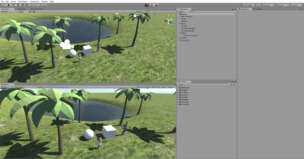
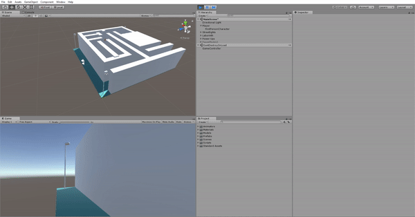

# Intelligent-Interfaces-Assignments
Repository to upload assignments of  Intelligent Interfaces course.

## Assignment 1

    

## Assignment 2

    

## Assigment 3

### Authors

* Carlos Domínguez García [carlosdg](https://github.com/carlosdg)
* Daute Rodríguez Rodríguez [DauteRR](https://github.com/DauteRR)

### Description

The scene represents a Labyrinth, as in our final project. There are two kinds of modifiers:

* **Speed Up modifiers**: Improves player jump and movement power.

    
    

* **Speed Down modifiers**: Decreases player jump and movement power. When the user collides with a Speed Down modifier, every Speed Down modifier present in the scene change its y position.

    
    

There are three lightspot controlled by pressing the "l" key.

    

## Assigment 4

### Authors

* Carlos Domínguez García [carlosdg](https://github.com/carlosdg)
* Daute Rodríguez Rodríguez [DauteRR](https://github.com/DauteRR)

### New features

* **Pause menu**: Pressing `p` key the game is paused.

    

* **Speed Up size**: Added an option on pause menu to change the speed up modifiers size.

    

* **Light intensity**: Added an option on pause menu to change the lights intensity.

    

## Assignment 5

### Authors

* Carlos Domínguez García [carlosdg](https://github.com/carlosdg)
* Daute Rodríguez Rodríguez [DauteRR](https://github.com/DauteRR)

    

## Assignment 6

### Authors

* Carlos Domínguez García [carlosdg](https://github.com/carlosdg)
* Daute Rodríguez Rodríguez [DauteRR](https://github.com/DauteRR)

### Description

Each time an object is pointed by the user with the reticle, the game does a request to a chat bot created with DialogFlow, depending on the response of the chat bot the object will perform some kind of action.

    

